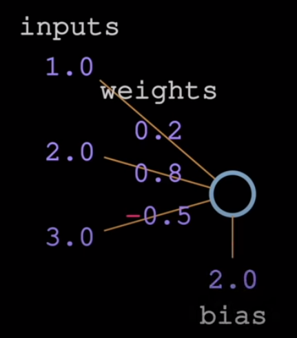
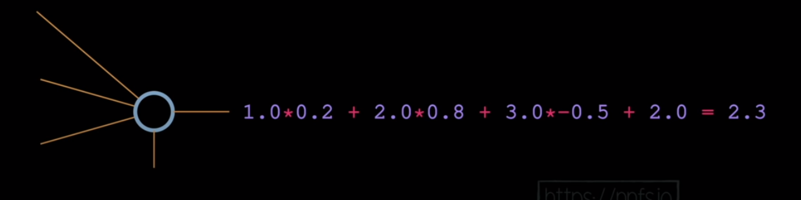
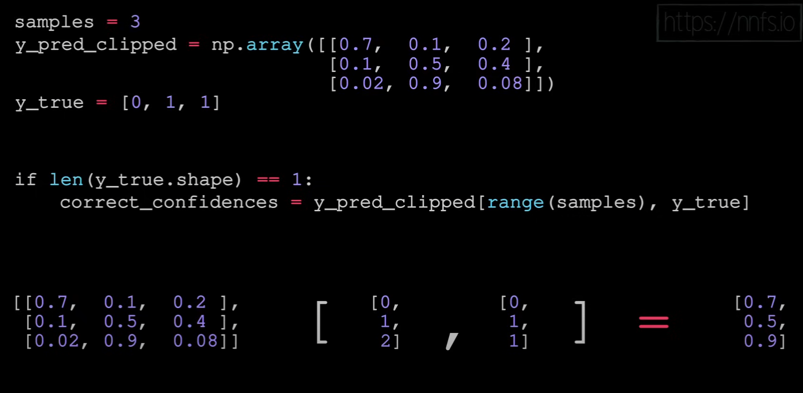
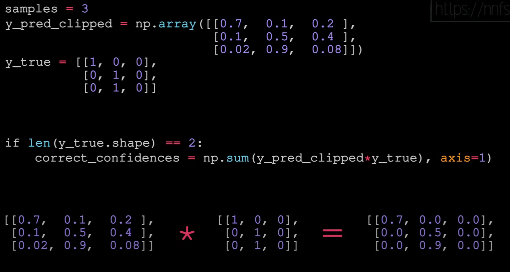

Reference: sentdex Neural Network from Scratch series [link](https://www.youtube.com/playlist?list=PLQVvvaa0QuDcjD5BAw2DxE6OF2tius3V3)
##  A Neuron

## Loss function in case of true scaler class values

## Loss function in case of one hot encoding vectors

